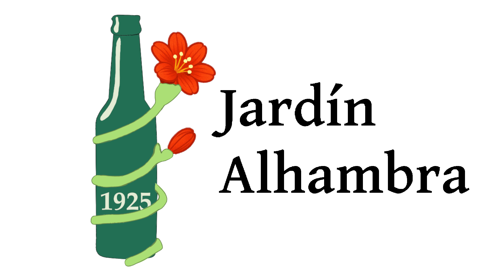

# DIU25
Prácticas Diseño Interfaces de Usuario (Tema: .... ) 

[Guiones de prácticas](GuionesPracticas/)

Grupo: DIU2_UXers.  Curso: 2024/25 

Actualizado: 04/04/2025

Proyecto: 

Jardín Alhambra

Descripción: 

Mejorar la página actual de Jardín Alhambra dotándola de mejor navegabilidad, más claridad y actualizarla.

Logotipo: 

Miembros:
 * :bust_in_silhouette:Germán Álvarez Gavilán  :octocat: https://github.com/gag-04
 * :bust_in_silhouette:Esther Prats Hodar :octocat: https://github.com/sthr20 

----- 

# Proceso de Diseño 

 

## Paso 1. UX User & Desk Research & Analisis 

### 1.a User Reseach Plan

Al comenzar la investigación no concíamos Jardín Alhambra y tampoco somos expertos en páginas web, aunque si hemos tenido algo de contacto con la programación de las mismas.

Para comenzar el proceso de research sobre el sitio, comenzaríamos entrevistando tanto al dueño y trabajadores del local, y pasando test a los asistentes a los distintos talleres en distintos días y horarios, para tener una visión completa de las necesidades y servicios de la empresa.

También sería útil analizar el porcentaje de reservas que se realizan desde la web y desde otros métodos, para lo que se necesitaría un estudio, que puede ser ya existente, si la empresa dispone de estos datos, o realizarse una vez iniciado el estudio.

Además definiríamos distintos escenarios, que cubran las tareas más comunes que se realizan en esta web. Y probaríamos a evaluarlos con distintos usuarios variados, desde algunos que nunca hayan sido clientes hasta clientes habituales,algunos ficticios y otros mediante pruebas reales. En el caso de los reales, mediríamos el tiempo que tardan en realizar la acción y mediante una encuesta, el grado de satisfacción y en el de los ficticios haríamos una estimación.

Tras esto, crearíamos los mapas de recorrido de estos usuarios para reconocer las dificultades que se pueden encontrar por el camino y poder solucionar estos puntos débiles de la página.

Por último,unos días o semanas después de implementar las mejoras, volveríamos a repetir el estudio de los datos de reservas y las pruebas a los usuarios anteriores, para ver si la experiencia ha mejorado realmente.

### 1.b Competitive Analysis
 
-----

Hemos elegido como competidores a Factoría Cruzcampo y Bodegas Montecillo, ambas ofrecen experiencias relacionadas con sus productos, ya sean visitas guiadas por la bodega o la fábrica y distintos talleres y conciertos en sus instalaciones, además de tener posibilidad de probar allí los productos.

### 1.c Personas

 **Amy**
-----

Amy es una mujer fotógrafa profesional de Australia que ha venido a Granada para trabajar y pretende ir a Jardín Alhambra para aumentar su portfolio y aprender sobre la cultura granadina.

 **Carlos**
----

Carlos es un policia granadino que fue el año pasado a Jardín Alhambra en varias ocasiones y este año quiere volver a probar la experiencia.

### 1.d User Journey Map
 **Amy** 
----
Un artista granadino le recomienda a Amy asistir a Jardín Alhambra y le muestra sus redes sociales. Ella decide mirar por su cuenta también tanto las redes sociales como la página web. Se encuentra todas las actividades agotadas y decepcionada, busca otras alternativas.

 **Carlos**   
----
Se acerca Abril y Carlos recuerda con sus amigos que el año anterior habían estado en Jardín Alhambra, por lo que decide mirar para intentar reservar para repetir este año, pero encuentra varios problemas y acaba dándose cuenta de que la web no está actualizada y busca otras opciones.

### 1.e Usability Review
 
----

Enlace: https://www.cervezasalhambra.com/es/momentos-alhambra/jardin
Valoración Numérica Obtenida: 7

Analizando la página nos dimos cuenta de varios fallos graves: 
 - La página está desactualizada.
 - El menú superior pertenece a la página general de Cervezas Alhambra y si lo usas no puedes volver a esta.
 - La información no está bien organizada, es una lista de actividades de muchos tipos y fechas.
 - No tiene imágenes para diferenciar las distintas actividades.

Tras analizarlo nuevamente, nos parece que la página debería haber tenido menos nota.

 

## Paso 2. UX Design  

### 2.a Reframing / IDEACION: Feedback Capture Grid / Empathy map 

----

Tras hacer el Empathy Map destacamos que por un lado, tanto las actividades como la estética del local es buena y atractiva, lo que hace que haya numerosos clientes interesados en asistir. Sin embargo, hemos visto que es muy probable que los clientes decidan buscar otras opciones debido a la dificultad de la reserva, la cual es muy larga y tediosa, así como que la página no está actualizada y durante gran parte del año, es totalmente inútil.

 Interesante | Críticas     
| ------------- | -------
  Las actividades están bien planteadas | Hay poca disponibilidad
  El ambiente atrae a mucha gente | Esta gente no formaliza las reservas por las dificultad que supone hacerla
   - | La página web no está siempre actualizada, además, no muestra si está o no actualizada hasta que no ves que está todo agotado. 
  

### 2.b ScopeCanvas

----

En este ScopeCanvas hemos representado las necesidades de los usuarios y las acciones que pretendemos que estos realicen, además de los objetivos que nos marcamos como organización y las métricas que usaremos para medir nuestra eficacia. Todo esto con el propósito de extender la cultura granadina a la vez que promocionamos Cervezas Alhambra.

### 2.b User Flow (task) analysis 

-----

>>> Definir "User Map" y "Task Flow" ... enlazar desde P2/ y describir brevemente

### 2.c IA: Sitemap + Labelling 
  
----

>>> Identificar términos para diálogo con usuario (evita el spanglish) y la arquitectura de la información. Es muy apropiado un diagrama tipo sitemap y una tabla que se ampliaría para llevar asociado la columna iconos (tanto para la web como para una app). 

Término | Significado     
| ------------- | -------
  Login  | acceder a plataforma

### 2.d Wireframes

-----

>>> Plantear el diseño del layout para Web/movil (organización y simulación). Describa la herramienta usada 

 

## Paso 3. Mi UX-Case Study (diseño)

>>> Cualquier título puede ser adaptado. Recuerda borrar estos comentarios del template en tu documento

### 3.a Moodboard

-----

>>> Diseño visual con una guía de estilos visual (moodboard) 
>>> Incluir Logotipo. Todos los recursos estarán subidos a la carpeta P3/
>>> Explique aqui la/s herramienta/s utilizada/s y el por qué de la resolución empleada. Reflexione ¿Se puede usar esta imagen como cabecera de Instagram, por ejemplo, o se necesitan otras?

### 3.b Landing Page
 
----

>>> Plantear el Landing Page del producto. Aplica estilos definidos en el moodboard

### 3.c Guidelines
 
----

>>> Estudio de Guidelines y explicación de los Patrones IU a usar 
>>> Es decir, tras documentarse, muestre las deciones tomadas sobre Patrones IU a usar para la fase siguiente de prototipado. 

### 3.d Mockup
 
----

>>> Consiste en tener un Layout en acción. Un Mockup es un prototipo HTML que permite simular tareas con estilo de IU seleccionado. Muy útil para compartir con stakeholders

### 3.e ¿My UX-Case Study?
 
-----

>>> Publicar my Case Study en Github... Es el momento de dejar este documento para que sea evaluado y calificado como parte de la práctica
>>> Documente bien la cabecera y asegurese que ha resumido los pasos realizados para el diseño de su producto

 

## Paso 4. Pruebas de Evaluación 

### 4.a Reclutamiento de usuarios 

-----

>>> Breve descripción del caso asignado (llamado Caso-B) con enlace al repositorio Github
>>> Tabla y asignación de personas ficticias (o reales) a las pruebas. Exprese las ideas de posibles situaciones conflictivas de esa persona en las propuestas evaluadas. Mínimo 4 usuarios: asigne 2 al Caso A y 2 al caso B.

| Usuarios | Sexo/Edad     | Ocupación   |  Exp.TIC    | Personalidad | Plataforma | Caso
| ------------- | -------- | ----------- | ----------- | -----------  | ---------- | ----
| User1's name  | H / 18   | Estudiante  | Media       | Introvertido | Web.       | A 
| User2's name  | H / 18   | Estudiante  | Media       | Timido       | Web        | A 
| User3's name  | M / 35   | Abogado     | Baja        | Emocional    | móvil      | B 
| User4's name  | H / 18   | Estudiante  | Media       | Racional     | Web        | B 

### 4.b Diseño de las pruebas 
 
-----

>>> Planifique qué pruebas se van a desarrollar. ¿En qué consisten? ¿Se hará uso del checklist de la P1?

### 4.c Cuestionario SUS
 
----

>>> Como uno de los test para la prueba A/B testing, usaremos el **Cuestionario SUS** que permite valorar la satisfacción de cada usuario con el diseño utilizado (casos A o B). Para calcular la valoración numérica y la etiqueta linguistica resultante usamos la [hoja de cálculo](https://github.com/mgea/DIU19/blob/master/Cuestionario%20SUS%20DIU.xlsx). Previamente conozca en qué consiste la escala SUS y cómo se interpretan sus resultados
http://usabilitygeek.com/how-to-use-the-system-usability-scale-sus-to-evaluate-the-usability-of-your-website/)
Para más información, consultar aquí sobre la [metodología SUS](https://cui.unige.ch/isi/icle-wiki/_media/ipm:test-suschapt.pdf)
>>> Adjuntar en la carpeta P4/ el excel resultante y describa aquí la valoración personal de los resultados 

### 4.d A/B Testing
 
-----

>>> Los resultados de un A/B testing con 3 pruebas y 2 casos o alternativas daría como resultado una tabla de 3 filas y 2 columnas, además de un resultado agregado global. Especifique con claridad el resultado: qué caso es más usable, A o B?

### 4.e Aplicación del método Eye Tracking 

----

>>> Indica cómo se diseña el experimento y se reclutan los usuarios. Explica la herramienta / uso de gazerecorder.com u otra similar. Aplíquese únicamente al caso B.

  
>>> Cambiar esta img por una de vuestro experimento. El recurso deberá estar subido a la carpeta P4/  

>>> gazerecorder en versión de pruebas puede estar limitada a 3 usuarios para generar mapa de calor (crédito > 0 para que funcione) 

### 4.f Usability Report de B
 
-----

>>> Añadir report de usabilidad para práctica B (la de los compañeros) aportando resultados y valoración de cada debilidad de usabilidad. 
>>> Enlazar aqui con el archivo subido a P4/ que indica qué equipo evalua a qué otro equipo.

>>> Complementad el Case Study en su Paso 4 con una Valoración personal del equipo sobre esta tarea

 

## Paso 5. Exportación y Documentación 

### 5.a Exportación a HTML/React
 
----

>>> Breve descripción de esta tarea. Las evidencias de este paso quedan subidas a P5/

### 5.b Documentación con Storybook

----

>>> Breve descripción de esta tarea. Las evidencias de este paso quedan subidas a P5/

 

## Conclusiones finales & Valoración de las prácticas

>>> Opinión FINAL del proceso de desarrollo de diseño siguiendo metodología UX y valoración (positiva /negativa) de los resultados obtenidos. ¿Qué se puede mejorar? Recuerda que este tipo de texto se debe eliminar del template que se os proporciona 

